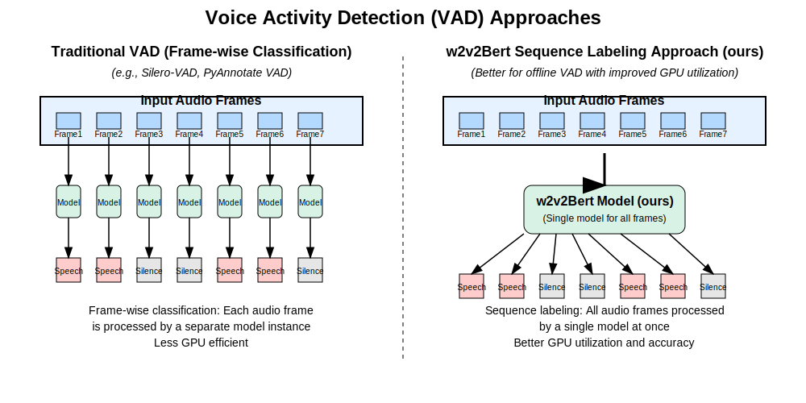

# Recitations Segmenter

<div align="center">
<strong>بتوفيق الله: نموذج ذكاء اصطناعي قادر على تقطيع التلاوات القرآنية على حسب الوقف بدقة عالية</strong>

[![Tests][tests-badge]][tests-url]
[![PyPI][pypi-badge]][pypi-url]
[![MIT License][mit-badge]][mit-url]
[![Python Versions][python-badge]][python-url]
[![Google Colab][colab-badge]][colab-url]

</div>

[tests-badge]: https://img.shields.io/github/actions/workflow/status/obadx/recitations-segmenter/tests.yml?branch=main&label=tests
[tests-url]: https://github.com/obadx/recitations-segmenter/actions/workflows/tests.yml
[pypi-badge]: https://img.shields.io/pypi/v/recitations-segmenter.svg
[pypi-url]: https://pypi.org/project/recitations-segmenter/
[mit-badge]: https://img.shields.io/github/license/obadx/recitations-segmenter.svg
[mit-url]: https://github.com/obadx/recitations-segmenter/blob/main/LICENSE
[python-badge]: https://img.shields.io/pypi/pyversions/recitations-segmenter.svg
[python-url]: https://pypi.org/project/recitations-segmenter/
[colab-badge]: https://img.shields.io/badge/Google%20Colab-Open%20in%20Colab-F9AB00?logo=google-colab&logoColor=white
[colab-url]: https://colab.research.google.com/drive/1-RuRQOj4l2MA_SG2p4m-afR7MAsT5I22?usp=sharing


بفضل الله نقدم نموذج اصطناعي محَّسن من [W2v2Bert](https://huggingface.co/docs/transformers/model_doc/wav2vec2-bert) على أساس مهمة Sequence Frame Level Classification بدقة 20 ملي ثانية (20 milliseconds)  ومعه أيضا مكتبة python تعمل بأداء عالي لأي عدد وأي طول (صغير أم كبير) من التلاوات القرآنية




## المميزات

* تقطيع التلاوات القرآنية على حسب الوقف

* مدَّرب خصيصا للتلاوات القرآنية

* بدقة عالية تصل إلى 20 ملي ثانية

* تحتاج فقط إلي 2 GB من ذاكرة الرسوميات (GPU Memory)

* يستطيع تقطيع  التلاوات القرآنية لأي مدة من التلاوات من بضع دقايق إلى عدة ساعات من غير نقص في الأداء

  


## تثبيت المكتبة

### متطلبات التثبيت

تثبيت مكتبتي:

* [ffmbeg](https://ffmpeg.org/download.html)
* [libsoundfile](https://github.com/libsndfile/libsndfile/releases)

#### Linux

```bash
sudo apt-get update
sudo apt-get install -y ffmpeg libsndfile1 portaudio19-dev
```

#### Winodws & Mac

يمكنك إنشاء بيئة `anaconda` . ومن ثم تنزيل هاتين المكتبتين

```bash
conda create -n segment python=3.12
conda activate segment
conda install -c conda-forge ffmpeg libsndfile
```

### تثبيت المكتبة

####  باستخدام pip

```bash
pip install recitations-segmenter
```

####  باستخدام uv

```bash
uv add recitations-segmenter
```


## Command Line Interface

يمكنك مباشرة استخدام المكتبة من وبدون تثبيت المكتبة عن طريق:

```bash
uvx recitations-segmenter alfateha.mp3 
```

أو بعد التثبيت باستخدام: 

```bash
recitations-segmenter alfateha.mp3 
```

سيتم استخراج توقيتات التلاوات على حسب الوقف على هيئتين: 

### في ال terminal
```text
100%|██████████████████████████████████████████████████████████████████████████████████████████████████████████████████████████████████████████████████████| 1/1 [00:03<00:00,  3.04s/it]
Speech Intervals:
tensor([[ 0.7300,  5.2900],
        [ 6.5100, 10.9900],
        [12.4700, 17.2100],
        [18.1500, 21.6850],
        [22.6850, 26.2650],
        [27.4450, 33.2050],
        [34.2650, 38.6250],
        [39.8250, 53.3200]])

```
### وعلى هيئة ملف JSON في المسار : `output/speech_intervals_alfateha.json`

سيتم استخراج توقيتات لكل مقطع قرآني بداخل سورة الفاتة في المسار : `output` ويحتوي على ملف `speech_intervals_alfateha.json`. ويحتوي هذا الملف على الآتي:

```json
{
    "clean_speech_intervals": [
        [
            0.7300000190734863,
            5.289999961853027
        ],
        [
            6.510000228881836,
            10.989999771118164
        ],
        [
            12.470000267028809,
            17.209999084472656
        ],
        [
            18.149999618530273,
            21.684999465942383
        ],
        [
            22.684999465942383,
            26.264999389648438
        ],
        [
            27.44499969482422,
            33.20500183105469
        ],
        [
            34.26499938964844,
            38.625
        ],
        [
            39.82500076293945,
            53.31999969482422
        ]
    ],
    "speech_intervals": [
        [
            0.7599999904632568,
            5.260000228881836
        ],
        [
            6.539999961853027,
            10.960000038146973
        ],
        [
            12.5,
            17.18000030517578
        ],
        [
            18.18000030517578,
            21.655000686645508
        ],
        [
            22.71500015258789,
            26.235000610351562
        ],
        [
            27.475000381469727,
            33.17499923706055
        ],
        [
            34.29499816894531,
            38.595001220703125
        ],
        [
            39.85499954223633,
            53.290000915527344
        ]
    ],
    "is_complete": true
}
```

يتضمن كل ملف JSON على هذه المفاتيح:

* `clean_speech_intervals`:     التوقيتات بالثانية لبداية ونهاية كل مقطع بعد التنقيح
* `speech_intervals`: التوقيتات بالثانية لبداية ونهاية كل مقطع 
*  `is_complete`: هل التلاوة القرآنية تامة أم أن آخر المقطع لا يتضمن وقفا محضا


### وصف مفصل لل Command Line


```text
usage: recitations-segmenter [-h] [-o OUTPUT] [--min-silence-duration-ms MIN_SILENCE_DURATION_MS] [--min-speech-duration-ms MIN_SPEECH_DURATION_MS] [--pad-duration-ms PAD_DURATION_MS]
                             [--return-samples] [--batch-size BATCH_SIZE] [--max-duration-ms MAX_DURATION_MS] [--device {cpu,cuda}] [--dtype {bfloat16,float16,float32}]
                             inputs [inputs ...]

Segment Holy Quran rectiations into speech intervals based on وقف using Wav2Vec2Bert model.

options:
  -h, --help            show this help message and exit

Input/Output Options:
  inputs                Input paths (files or directories) containing audio files
  -o OUTPUT, --output OUTPUT
                        Output directory for JSON results (default: ./output)

Segmentation Parameters:
  --min-silence-duration-ms MIN_SILENCE_DURATION_MS
                        Minimum silence duration (ms) between speech segments
                        - Silence shorter than this will be merged with speech
                        - Default: 30ms
  --min-speech-duration-ms MIN_SPEECH_DURATION_MS
                        Minimum valid speech duration (ms)
                        - Speech segments shorter than this will be removed
                        - Default: 30ms
  --pad-duration-ms PAD_DURATION_MS
                        Padding added around speech segments (ms)
                        Default: 30ms
  --return-samples      Return intervals in samples according to 16000 sampling rate.
                        - Default to return interval in seconds

Model Configuration:
  --batch-size BATCH_SIZE
                        Number of audio chunks processed simultaneously
                        - Higher values may increase speed but require more GPU memory.
                        - Default: 8 which occupies nearly 3GB of GPU memory.
  --max-duration-ms MAX_DURATION_MS
                        Maximum processing chunk duration (2-20000ms)
                        - Affects memory usage and processing granularity
                        - Do not Change it unless there exists a strong reason.
                        - Default: 19995ms
  --device {cpu,cuda}   Processing device selection
                        Default: cuda
  --dtype {bfloat16,float16,float32}
                        Numerical precision for model computation:
                        - bfloat16: Best performance (modern GPUs)
                        - float16: Legacy support
                        - float32: Maximum precision (CPU fallback)
                        Default: bfloat16

Examples:
  # Process single file with default settings
  recitations-segmenter input.mp3 -o results

  # Process multiple files file with default settings
  recitations-segmenter input1.mp3 input2.wav -o output

  # Process directory of audio files
  recitations-segmenter /path/to/recitations/ --output ./segmentation_results

  # Process: audio files and directory of audio files
  recitations-segmenter input.mp3 /path/to/recitations/ --output ./segmentation_results

  # Adjust segmentation parameters
  recitations-segmenter input.wav --min-silence-duration-ms 200 --min-speech-duration-ms 900 --pad-duration-ms 40

File Formats Supported:
  MP3, WAV, FLAC, OGG, AAC, M4A, OPUS

Output Format:
  Each input file generates a JSON file containing:
  - clean_speech_intervals: Final filtered speech segments
  - speech_intervals: Raw detected speech segments
  - is_complete: whether the recitaion is a complete وقف or the recitation is contining (has not stoped yet)

Error Handling:
  - Skips unsupported file types


```


## API  باستخدام Python

موضح أدناه مثال كامل لاتسخدام المكتبة بال python ويوجد أيضا مثال داخل Google Colab:

[![Google Colab][colab-badge]][colab-url]

```python
from pathlib import Path

from recitations_segmenter import segment_recitations, read_audio, clean_speech_intervals
from transformers import AutoFeatureExtractor, AutoModelForAudioFrameClassification
import torch

if __name__ == '__main__':
    device = torch.device('cuda')
    dtype = torch.bfloat16

    processor = AutoFeatureExtractor.from_pretrained(
        "obadx/recitation-segmenter-v2")
    model = AutoModelForAudioFrameClassification.from_pretrained(
        "obadx/recitation-segmenter-v2",
    )

    model.to(device, dtype=dtype)

    # Change this to the file pathes of Holy Quran recitations
    # File pathes with the Holy Quran Recitations
    file_pathes = [
        './assets/dussary_002282.mp3',
        './assets/hussary_053001.mp3',
    ]
    waves = [read_audio(p) for p in file_pathes]

    # Extracting speech inervals in samples according to 16000 Sample rate
    sampled_outputs = segment_recitations(
        waves,
        model,
        processor,
        device=device,
        dtype=dtype,
        batch_size=8,
    )

    for out, path in zip(sampled_outputs, file_pathes):
        # Clean The speech intervals by:
        # * merging small silence durations
        # * remove small speech durations
        # * add padding to each speech duration
        # Raises:
        # * NoSpeechIntervals: if the wav is complete silence
        # * TooHighMinSpeechDruation: if `min_speech_duration` is too high which
        # resuls for deleting all speech intervals
        clean_out = clean_speech_intervals(
            out.speech_intervals,
            out.is_complete,
            min_silence_duration_ms=30,
            min_speech_duration_ms=30,
            pad_duration_ms=30,
            return_seconds=True,
        )

        print(f'Speech Intervals of: {Path(path).name}: ')
        print(clean_out.clean_speech_intervals)
        print(f'Is Recitation Complete: {clean_out.is_complete}')
        print('-' * 40)
```

## توقيق المكتبة (API Refernece)

### `segment_recitations`

```python
@torch.no_grad()
def segment_recitations(
    waves: list[torch.FloatTensor],
    model: Wav2Vec2BertForAudioFrameClassification,
    processor: Wav2Vec2BertProcessor,
    batch_size=64,
    device=torch.device('cpu'),
    dtype=torch.bfloat16,
    return_probabilities=False,
    sample_rate=16000,
    processor_window=400,
    processor_hop=160,
    processor_stride=2,
    max_duration_ms=19995,
    speech_label=1,
    silence_label=0,
    cache_dir: Optional[str | Path] = None,
    overwrite_cache: Optional[bool] = False,
) -> list[W2vBSegmentationOutput]:

```

Segment The Holy Quran rectiations into speech intervals based on وقف using Wav2Vec2Bert model.

**Arguments**:
- `waves` (`list[torch.FloatTensor]`): List of audio waveforms to process (each as FloatTensor)
- `model` (`Wav2Vec2BertForAudioFrameClassification`): Loaded Wav2Vec2BertForAudioFrameClassification model
- `processor` (`Wav2Vec2BertProcessor`): Wav2Vec2BertProcessor for feature extraction
- `batch_size` (`int`): Number of samples per batch
- `sample_rate` (`int`): Input audio sampling rate (must be 16000)
- `processor_window` (`int`): Processor window size (fixed at 400 samples)
- `processor_hop` (`int`): Processor hop length (fixed at 160 samples)
- `processor_stride` (`int`): Processor stride (fixed at 2)
- `max_duration_ms` (`int`): Maximum chunk duration in ms for processing (2-20000)
- `speech_label` (`int`): Class index for speech segments
- `silence_label` (`int`): Class index for silence segments
- `device` (`torch.device`): Torch device for inference
- `dtype` (`torch.dtype`): Data type for model computation only. Default it `torch.bfloat16` for post processing we use `torch.float32`
- `return_probabilities` (`bool`): Whether to return class probabilities
- `cache_dir` (`Optional[str | Path]`): Optional feature disabled by default: if it is not `None`. Saving speech intervals to the `cach_dir` so next time for inference with the sample input `waves` we did not have to recompute the speech_intervals
- `overwrite_cache` (`Optional[bool]`): if there exists a `cache_dir` overwrite it.

**Returns**:
- `list[W2vBSegmentationOutput]`:
-  Every `W2vBSegmentationOutput` is:
  - `clean_speech_intervals` (`torch.FloatTensor`):  `None`.
  - `speech_intervals` (`torch.FloatTensor`): Tensor of shape (N, 2) containing raw speech intervals before filtering. Format: `[[speech_start, speech_end], [speech_start, speech_end], ...]` in samples.
  - `probs` (`torch.FloatTensor | None`): Class probabilities (None if not requested)
  - `is_complete` (`bool`): Whether audio processing completed normally

**Note**:
- Processes audio in chunks of max_duration_ms for GPU memory efficiency
- Input waveforms are automatically padded and batched
- Final interval end is clamped to (audio_length + hop*stride) if not provided

---

### `clean_speech_intervals`

```python
def clean_speech_intervals(
    speech_intervals: torch.LongTensor,
    is_complete: bool,
    min_silence_duration_ms=30,
    min_speech_duration_ms=30,
    pad_duration_ms=30,
    sample_rate=16000,
    return_probabilities=False,
    return_seconds=False,
) -> W2vBSegmentationOutput:
```

Permores cleaning on raw speech intervals extracted by the model. Clean The speech intervals by:
* merging small silence durations.
* remove small speech durations.
* add padding to each speech duration.

**Arguments**:
- `speech_intervals` (`torch.LongTensor`): Tensor of shape (N, 2) containing raw speech intervals before filtering. Format: `[[speech_start, speech_end], [speech_start, speech_end], ...]` in samples.
- `is_complete` (`bool`): Whether audio processing completed normally
- `min_silence_duration_ms` (`int`): Minimum silence duration (ms) between speech segments. silence durations < `min_silence_duration_ms` will be merged into speech durations
- `min_speech_duration_ms` (`int`): Minimum duration (ms) for a valid speech segment. speech intervals durations < `min_speech_duration_ms` will be removed
- `pad_duration_ms` (`int`): Padding duration (ms) to add around speech segments
- `sample_rate` (`int`): Audio sample rate in Hz
- `return_probabilities` (`bool`): Whether to return class probabilities
- `return_seconds` (`bool`): Whether to return intervals in seconds instead of samples

**Returns**:
- `W2vBSegmentationOutput`:
  - `clean_speech_intervals` (`torch.FloatTensor`): Tensor of shape (N, 2) containing speech intervals after filtering. Format: `[[speech_start, speech_end], ...]` in samples if `return_seconds` is `false`. otherwise return the speech inervals in seconds.
  - `speech_intervals` (`torch.FloatTensor`): Tensor of shape (N, 2) containing raw speech intervals before filtering. Format: `[[speech_start, speech_end], ...]` in samples if `return_seconds` is `false`. otherwise return the speech inervals in seconds
  - `probs` (`torch.FloatTensor | None`): Class probabilities (None if not requested)
  - `is_complete` (`bool`): Whether audio processing completed normally

**Raises**:
- `NoSpeechIntervals`: If no speech segments are detected
- `TooHighMinSpeechDuration`: If filtering removes all speech segments

**Note**:
- Intervals are clamped to prevent negative starts or exceeding audio length
- Final interval end is clamped to (audio_length + hop*stride) if not provided

### Data Structures

### `W2vBSegmentationOutput`
Named tuple containing:
- `clean_speech_intervals`: `torch.Tensor` or `None`
- `speech_intervals`: `torch.Tensor`
- `probs`: `torch.Tensor` or `None`
- `is_complete`: `bool`

### Exceptions
- `NoSpeechIntervals`: Raised when input contains no speech
- `TooHighMinSpeechDuration`: Raised when filtering removes all segments

##  تفاصيل التدريب

### دوافع تدريب نموذج جديد وعدم استخدام الطرق الحالية
كان الهدف هو تقطيع التلاوات القرآنية على حسب الوقف بجودة عالية ودقة تصل ل 50 ملي ثانية باستخدام تقنية Voice Activity Detectoin (VAD) وتم تجربة:

* نموذج [sliero-vad-v5](https://github.com/snakers4/silero-vad) وللأسف كان سيئا جدا على الرغم من أن دقته تصل 32 ملي ثانية
* نموذج [sliero-vad-v4](https://github.com/snakers4/silero-vad/tree/v4.0stable) أفضل أداءا من النسخة الأخيرة على بعض التلاوات القرآنية ودقتخ تبلغ 95 ملي ثانية
* نمذوج pyannotate كان سيئا على الإطلاق 
تم تجربة نماذج أخرى كانت سيئة جدا

### طريقة حل المشكلة

الهدف في هو تقطيع التلاوات القرآنية على حسب الوقف لبناء قواعد بيانات قرآنية. فالهدف ليس ال streaming بل هو بناء قواعد بيانات من التلاوات القرآنية. ومن ثم فحجم النموذج لا يلزمه الكبر أو الصغر بال الدقة والجودة أهم الأشياء فوع الاختيار على [w2v2Bert](https://huggingface.co/docs/transformers/model_doc/wav2vec2-bert) لأنه:

* مدرب على 4.5 مليون ساعة متعدة اللهجات واللغات
* النموذج مدَّرب على أكثر من 100 ألف ساعة من الأصوات العربية
* صغر نافذته حيث كل نافذة من مستخرج المميزات (feature extractor) تبلغ 20 ملي ثانية

ومن هاهنا تم تدريب [w2v2Bert](https://huggingface.co/docs/transformers/model_doc/wav2vec2-bert) ك sequence labeling لكل نافذة على تلاوات قرآنية شبه معلّمة تلقائيا بساتخدام أفضل VAD تم الحصول عليه.


### تهيئة بيئة التطوير

#### تثبيت المتطلبات

تثبيت مكتبتي:

* [ffmbeg](https://ffmpeg.org/download.html)
* [libsoundfile](https://github.com/libsndfile/libsndfile/releases)

##### Linux
```bash
sudo apt-get update
sudo apt-get install -y ffmpeg libsndfile1 portaudio19-dev
```

##### Winodws & Mac

يمكنك إنشاء بيئة `anaconda` . ومن ثم تنزيل هاتين المكتبتين

####  تثبيت بيئة التطوير

First of all glone the repo

```bash
git clone https://github.com/obadx/recitations-segmenter.git
```

To fully reproduce an environment using a `uv.lock` file, follow these steps:

##### 1. **Install `uv`**
   First, ensure the `uv` tool is installed. You can install it using the official installation script:
   ```bash
   curl -LsSf https://install.python-uv.dev | sh
   ```
   This installs `uv` into your system. Verify the installation:
   ```bash
   uv --version
   ```

##### 2. **Create virtual environment**

We are using python version `3.12`

```bash
uv venv --python 3.12
```
   

##### 3. **Recreate the Environment**
   In the project directory containing both `pyproject.toml` and `uv.lock`, run:
   
   ```bash
   uv sync
   ```
   
   This command:
   - Uses `uv.lock` to install **exact versions** of all dependencies (including transitive ones).
   - Creates a virtual environment in `.venv/` by default.
   - Installs dependencies into the virtual environment.

   **Note**: `uv.sync` requires `pyproject.toml` to identify direct dependencies. If you only have `uv.lock`, recreate `pyproject.toml` by listing direct dependencies manually or extract them from the lock file.

### 4. **Activate the Virtual Environment**
   After installation, activate the virtual environment:
   ```bash
   source .venv/bin/activate  # On Unix/macOS
   .venv\Scripts\activate     # On Windows
   ```

### 5. **Verify the Environment**
   Confirm the environment is set up correctly:
   ```bash
   python -m pip list  # Should show packages from uv.lock
   ```

### بيانات التدريب

### طريقة تجميع البيانات

### تهيئة البيانات

### التدريب

## Installtion

> Note: for data builindg we worked on python 3.13 and for augmentations we worked to python 3.12 due to audiomentatiosn depends on scipy

* Install `ffmbeg` using conda

```bash
conda install -c conda-forge ffmpeg
```

* Install `scipy` using anaconda

```bash
conda install -c conda-forge scipy=1.15.2
```

## Chosing hypberparameters

We have chosed the `max_recitaton_seconds` to be `20` secons and the rests of the samples will be split uising sliding window algorigh with overlap of `1` second


## TODO

* [x] Test the model on notebook.
* [x] Add CI/CD checking python versions.
* [x] Add commdnad line tool to API.
* [x] Add pytest for the cli.
* [x] Whether to raise execption or not if no speech found
* [x] Add caching mechanism.
* [x] Project Description
* [x] API docs
* [ ] train docs
* [ ] datasets docs (create and description)
* [x] Add lock file for reproudcing training
* [ ] Steps to reprouduce Dev environment [see](https://chat.qwen.ai/s/75280423-a193-4f1b-a35b-93a5f8e03ff8?fev=0.0.87)
* [x] Add libsoundfile and ffmbeg as backend for reading mp3 files
* [ ] publish to pypip

