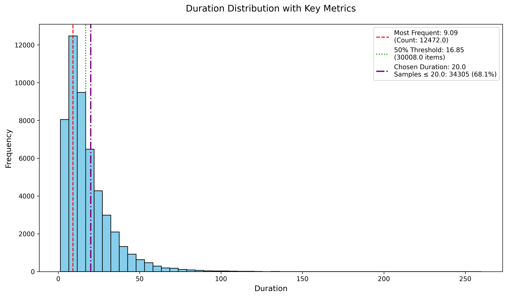

# recitations-segmenter

A Machine Learning Model that split a recitations on pauses (وقف) not by Ayah.

## Installtion

> Note: for data builindg we worked on python 3.13 and for augmentations we worked to python 3.12 due to audiomentatiosn depends on scipy

* Install `ffmbeg` using conda

```bash
conda install -c conda-forge ffmpeg
```

* Install `scipy` using anaconda

```bash
conda install -c conda-forge scipy=1.15.2
```

## Chosing hypberparameters

We have chosed the `max_recitaton_seconds` to be `20` secons and the rests of the samples will be split uising sliding window algorigh with overlap of `1` second


